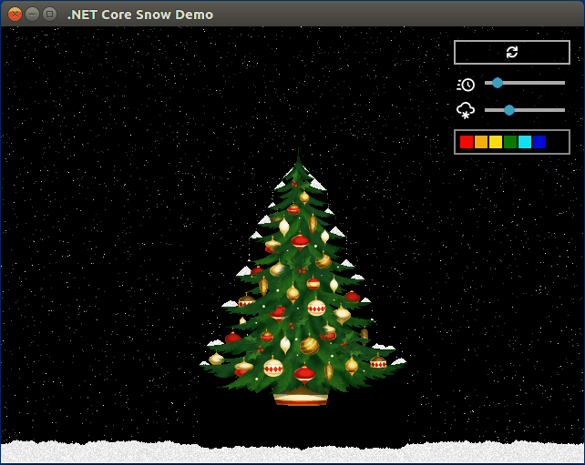

# Let It Snow!

Cross-platform falling snow demo on .NET Core and [Avalonia UI](https://github.com/AvaloniaUI/Avalonia).

## Build and Run (Windows, Linux, macOS)

- Install [.NET Core SDK](https://www.microsoft.com/net/download)
- `git clone https://github.com/ptupitsyn/let-it-snow.git`
- `cd let-it-snow/AvaloniaCoreSnow`
- `dotnet run`

## Usage

- Move sliders to control speed and snowflake count
- Reset button to start over
- Left mouse button to draw
- Right-click to load an image